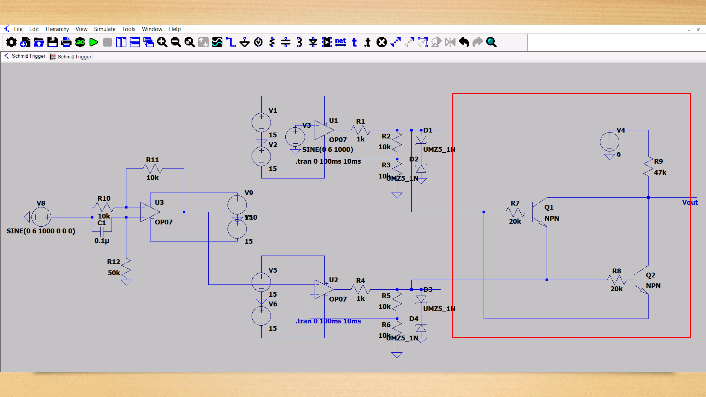
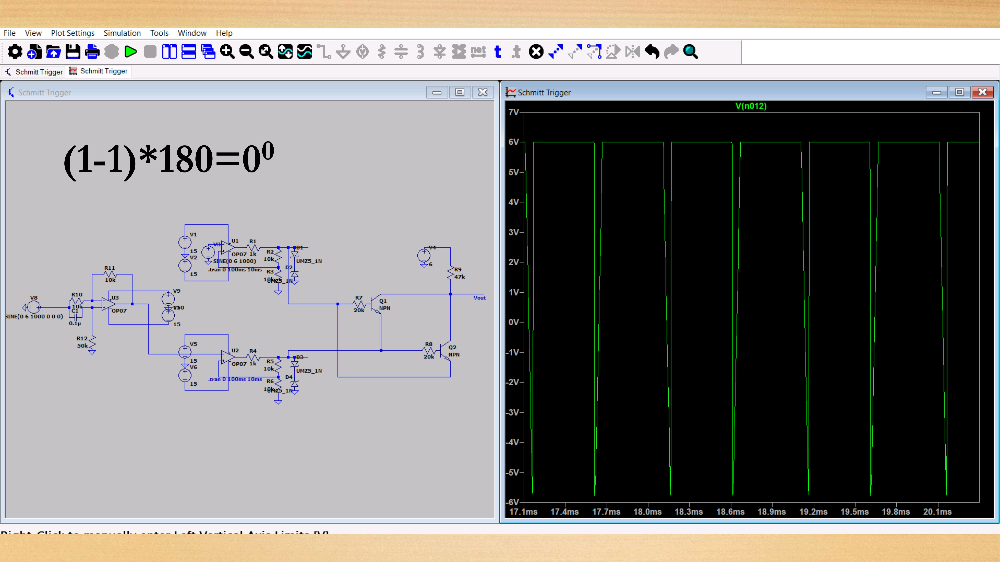
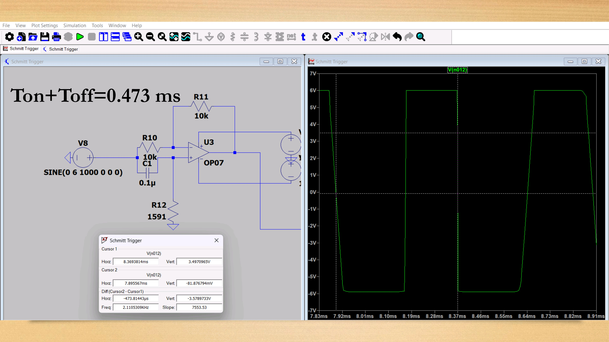
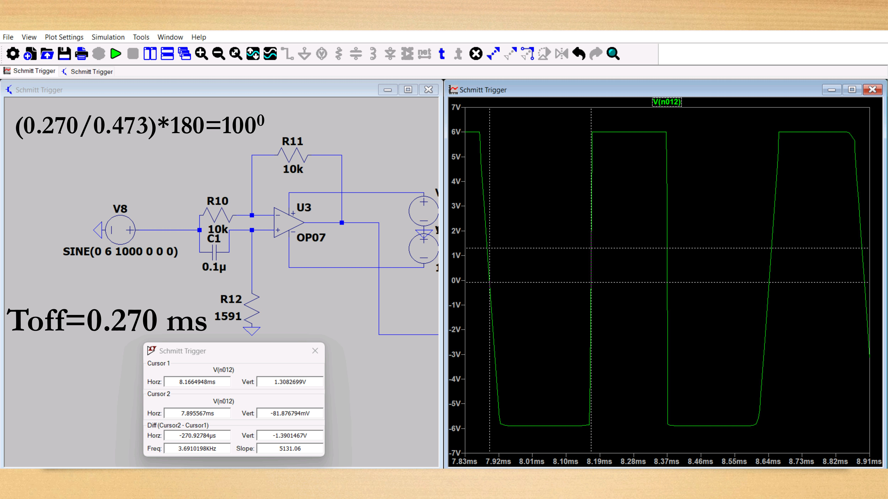
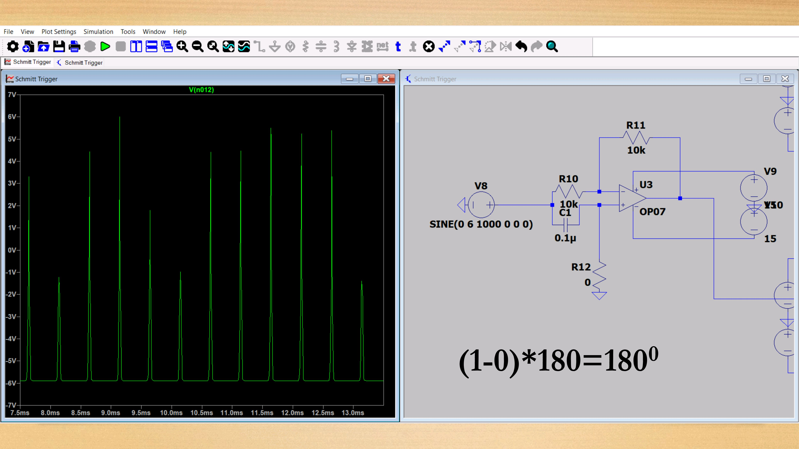

## 3. XNOR using BJTs
- XNOR of two digital signals can be done with the help of 2 BJTs.
- The duty cycle of resultant waveform can be used for phase difference calculation.

## LTspice circuits and simulations

